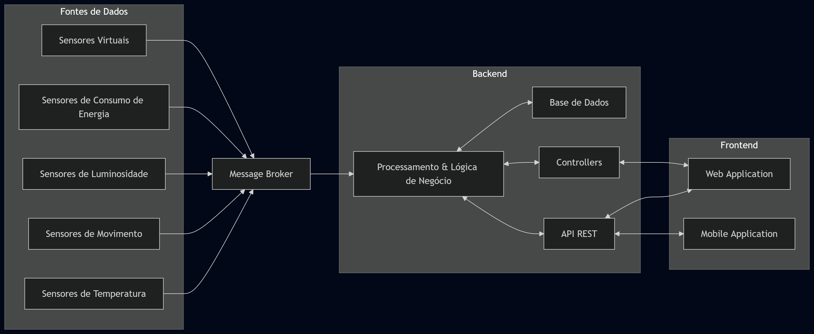

# Smart Home Dashboard

## Project Abstract
Plataforma de gestão doméstica inteligente para processamento de fluxos de dados de temperatura, movimento, luz e consumo energético, visando a automação e otimização de ambientes residenciais.

## Project Team
| Nome | NMec | Função Principal |
| :--- | :--- | :--- |
| Diogo Ruivo | 126498 | Team Manager |
| David Cálix | 125043 | Product Owner |
| Gabriel Riquito | 126427 | Architect |
| Rodrigo Fonseca | 124726 | DevOps Master |

## Architecture diagram

## Bookmarks
* [**Gestão de Projeto (Backlog)**](https://github.com/orgs/detiuaveiro/projects/237)
* [**Atas de Reunião**](./minutes/)