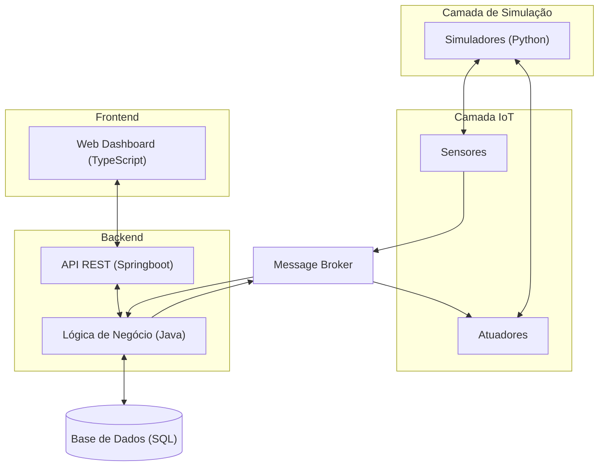
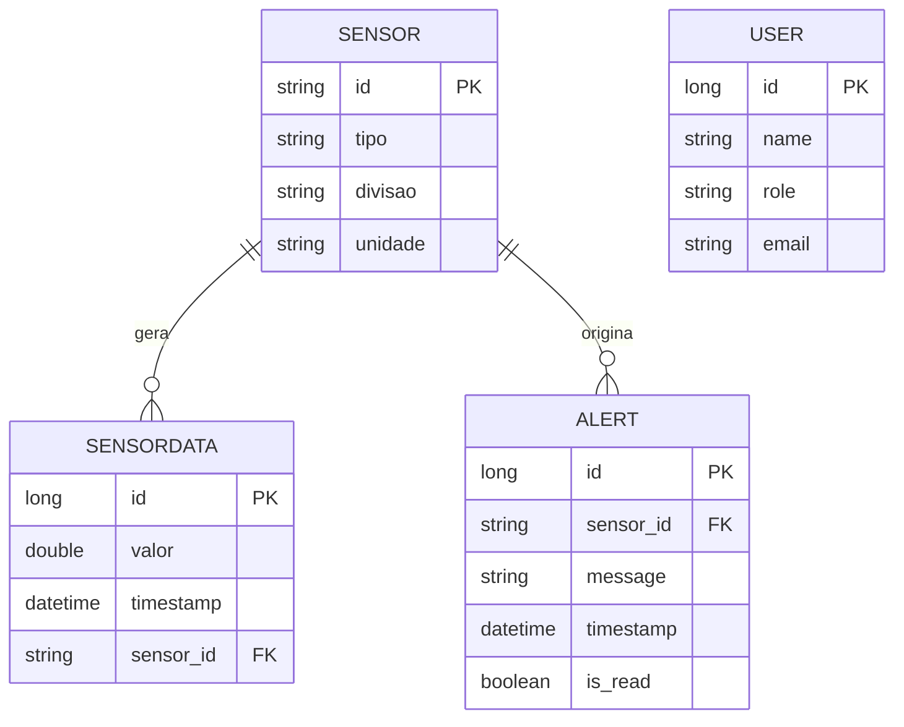

```mermaid
graph TD
    subgraph "Camada de Simulação"
        SIM["Simuladores      (Python)"]
    end

    subgraph "Camada IoT"
        S[Sensores]
        A[Atuadores]
    end

    MQ[Message Broker]

    subgraph "Backend"
        BL["Lógica de Negócio (Java)"]
        API["API REST (Springboot)"]
    end

    DB[("Base de Dados (SQL)")]


    subgraph "Frontend"
        WA["Web Dashboard (TypeScript)"]
    end

    SIM <--> S
    SIM <--> A

    S --> MQ
    MQ --> BL
    BL <--> DB

    WA <--> API
    API <--> BL
    BL --> MQ
    MQ --> A
```

# ESQUEMA RELACIONAL (MERMAID ERD)

```mermaid id="rel1"
erDiagram

    SENSOR {
        string id PK
        string tipo
        string divisao
        string unidade
    }

    SENSORDATA {
        long id PK
        double valor
        datetime timestamp
        string sensor_id FK
    }

    ALERT {
        long id PK
        string sensor_id FK
        string message
        datetime timestamp
        boolean is_read
    }

    USER {
        long id PK
        string name
        string role
        string email
    }

    SENSOR ||--o{ SENSORDATA : "gera"
    SENSOR ||--o{ ALERT : "origina"
```

