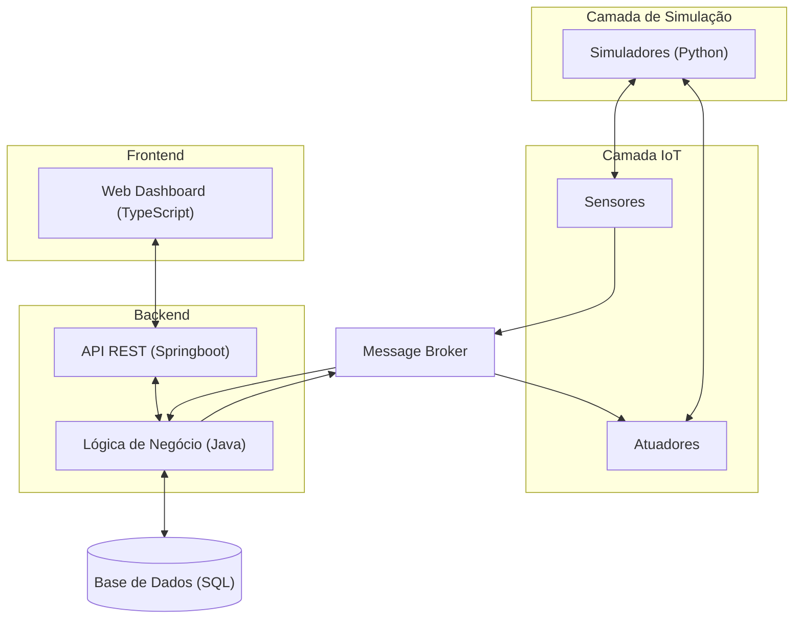

# **Smart Home Dashboard – Sprint 2**

---

## 1. Introdução ao Projeto

O **Smart Home Dashboard** é uma plataforma web centrada no utilizador, destinada a apoiar a gestão do ambiente doméstico inteligente.

O objetivo principal do projeto é permitir ao utilizador:

* Monitorizar em tempo real as condições da habitação;
* Controlar remotamente dispositivos como aquecimento e iluminação;
* Definir automações baseadas em regras;
* Receber alertas em situações anómalas;
* Consultar dados históricos e exportar relatórios de consumo energético.

O sistema é composto por: **Simulador de sensores**, **Backend com API REST**, **Base de Dados** e **Dashboard Web**.

---

## 2. Sprint 2 – O que fizemos

Durante esta sprint, realizámos várias atividades chave:

### Principais Conquistas

* **Protótipos concluídos:** Criados e refinados em **Figma**, com fluxo de navegação simples e interface funcional.
* **Arquitetura finalizada:** Definida de forma distribuída, contemplando simuladores, backend, frontend e base de dados.
* **Report.md atualizado:** Documenta arquitetura, user stories, diagramas e decisões da equipa.
* **Diagramas de User Stories:** Documentam interações entre utilizadores, frontend, backend e sensores.

### Reuniões

| Reunião | Data       | Foco                     | Conquistas                                                                                                |
| ------- | ---------- | ------------------------ | --------------------------------------------------------------------------------------------------------- |
| **1**   | 10/03/2026 | Arquitetura e requisitos | Suporte a atuadores, conversão de US em requisitos técnicos, definição de interface Web para MVP.         |
| **2**   | 17/03/2026 | Protótipos e UI          | Planeamento de protótipos na Stitch/Figma, definição de fluxo de navegação e responsabilidades da equipa. |
| **3**   | 18/03/2026 | Consolidação e report    | Protótipos concluídos, arquitetura final, diagramas de User Stories, report.md redigido.                  |

---

## 3. Arquitetura do Sistema

A arquitetura definida para o **Smart Home Dashboard** é distribuída e desacoplada, com cinco componentes principais:

* **Camada de Simulação (Simuladores Python)**: Sensores e atuadores virtuais que geram e recebem dados.
* **Camada IoT**: Sensores e atuadores conectados ao **Message Broker**.
* **Backend (API REST em Springboot)**: Lógica de negócio, processamento de eventos, gestão de comandos e base de dados.
* **Base de Dados (SQL)**: Armazena histórico de sensores, eventos e comandos.
* **Frontend (Web Dashboard em TypeScript)**: Visualização em tempo real, controlo de dispositivos, dashboards de alertas.

### Diagrama da Arquitetura

---

## 4. Protótipos em Figma

Os protótipos foram criados para **representar as principais funcionalidades** e fluxos de utilizador do sistema. Cada protótipo reflete as necessidades específicas das nossas **personas**:

### Personas e Principais User Cases

| Persona                         | Objetivos / Desejos                     | Principais User Cases                                                                                                                        |
| ------------------------------- | --------------------------------------- | -------------------------------------------------------------------------------------------------------------------------------------------- |
| **Programador em Teletrabalho** | Manter conforto e produtividade em casa | Atuar remotamente em aquecimento e luzes, receber alertas de qualidade do ar, ajustar luminosidade para reduzir fadiga ocular                |
| **Mãe**                         | Segurança e bem-estar do bebé           | Receber alertas de movimento no quarto, consultar histórico térmico, auditar rotina de luzes e sensores                                      |
| **Reformado**                   | Gestão eficiente de energia e segurança | Monitorizar consumo por divisão, alertas de gastos excessivos, automação de iluminação noturna, exportação de relatórios de consumo          |
| **Admin / Técnico de Sistemas** | Manter integridade e saúde do sistema   | Monitorização da performance da API e dos sensores, validação da conectividade, análise de logs, controle e configuração inicial de hardware |

### Funcionalidades refletidas nos protótipos

* **Dashboard Técnico do Admin:** Estado da infraestrutura, logs e alertas (US1, US2).
* **Controle Remoto:** Atuação em luzes e aquecimento (US5).
* **Visualização de Consumo:** Gráficos por divisão e alertas de gasto (US9, US11, US12).
* **Alertas de Movimento e Histórico:** Segurança e conforto para a Mãe e Programador (US6, US7, US3, US4).

> **Nota:** Os protótipos em png e em HTML encontram-se em `prototypes`.
> Alguns diagramas detalhados, user stories associadas e links para os protótipos estão documentados em **diagrama.md**, mostrando a ligação entre arquitetura, personas e casos de uso.

* [**Protótipos**](../../prototypes/diagramas.md)

---

## 5. Próximo Sprint – Sprint 3 (I3)

As atividades previstas incluem:

* Definir e implementar todos os **endpoints da API REST (CRUD)**;
* Demonstrar a arquitetura **end-to-end** usando **Postman**;
* Incrementar **deployment em containers** no servidor;
* Atualizar e completar **documentação da API** no report.

---

## 6. Equipa

| Nome            | Função        |
| --------------- | ------------- |
| Diogo Ruivo     | Team Manager  |
| David Cálix     | Product Owner |
| Gabriel Riquito | Architect     |
| Rodrigo Fonseca | DevOps Master |
