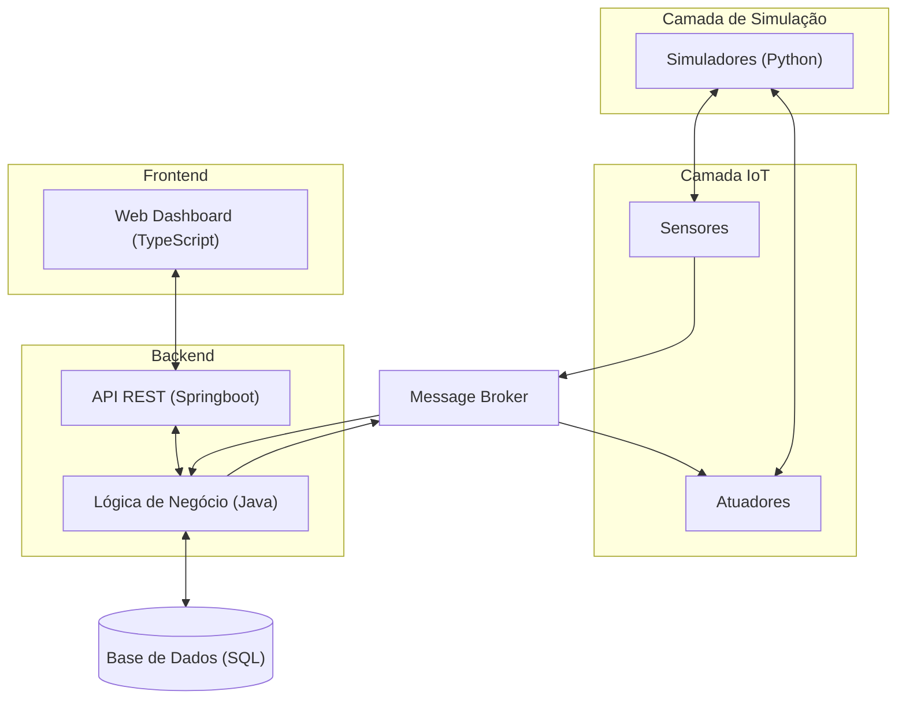

# Smart Home Dashboard – Sprint 2

---

## 1. Introdução ao Projeto

O **Smart Home Dashboard** é uma plataforma web centrada no utilizador que permite gerir uma casa inteligente de forma simples, confortável e segura.

O sistema permite:

* Monitorizar condições da habitação em tempo real;
* Controlar dispositivos remotamente (aquecimento e iluminação);
* Definir automações inteligentes;
* Receber alertas em situações críticas;
* Consultar histórico e analisar consumo energético.

O sistema é composto por quatro componentes principais:
**Simulador de sensores**, **Backend com API REST**, **Base de Dados** e **Dashboard Web**.

---

## 2. Sprint 2 – Trabalho Realizado

Durante esta sprint, focámo-nos na definição funcional e estrutural do sistema.

### Principais Conquistas

* Protótipos completos e funcionais (Stitch/Figma);
* Arquitetura distribuída definida e validada;
* Criação de diagramas de User Stories;
* Atualização do **report.md** com arquitetura e decisões.

### Reuniões

| Reunião | Foco                     | Resultado principal                                                                 |
|--------|--------------------------|------------------------------------------------------------------------------------|
| 1      | Arquitetura e requisitos | Introdução de atuadores e definição do modelo do sistema                           |
| 2      | Protótipos              | Planeamento dos protótipos e escolha da abordagem visual                          |
| 3      | Consolidação            | Protótipos finalizados, arquitetura estabilizada e report concluído               |

---

## 3. Arquitetura do Sistema

A arquitetura do sistema segue uma abordagem distribuída e desacoplada:

* **Simulação:** Sensores e atuadores virtuais (Python)
* **IoT Layer:** Comunicação através de Message Broker
* **Backend:** API REST + lógica de negócio (Springboot)
* **Base de Dados:** Persistência de dados (SQL)
* **Frontend:** Dashboard web (TypeScript)

### Diagrama da Arquitetura

---

## 4. Protótipos e Personas

Os protótipos foram desenvolvidos com base nas necessidades das diferentes **personas do sistema**:

| Persona     | Objetivo principal          |
| ----------- | --------------------------- |
| Programador | Conforto e produtividade    |
| Mãe         | Segurança e monitorização   |
| Reformado   | Eficiência energética       |
| Admin       | Saúde e controlo do sistema |

### Funcionalidades principais

* Monitorização técnica do sistema (Admin)
* Controlo remoto de dispositivos
* Visualização de consumo energético
* Sistema de alertas e eventos

---

## 5. Ligação entre Protótipos e Arquitetura

Para demonstrar como os protótipos se ligam à arquitetura e às user stories, criámos um documento dedicado com:

* User Stories organizadas por persona
* Diagramas de interação (Frontend ↔ Backend ↔ Sensores)
* Protótipos associados a cada caso de uso

**Abrir diagramas e protótipos detalhados:**

[Ver Diagramas de User Stories](../../prototypes/diagramas.md)

---

## 6. Próximo Sprint – Sprint 3 (I3)

Objetivo: **Implementação da API e validação end-to-end**

* Definir e implementar endpoints REST (CRUD);
* Testar comunicação completa usando Postman;
* Deploy em containers (Docker);
* Documentação da API (Swagger/OpenAPI).

---

## 7. Equipa

| Nome            | Função        |
| --------------- | ------------- |
| Diogo Ruivo     | Team Manager  |
| David Cálix     | Product Owner |
| Gabriel Riquito | Architect     |
| Rodrigo Fonseca | DevOps Master |
