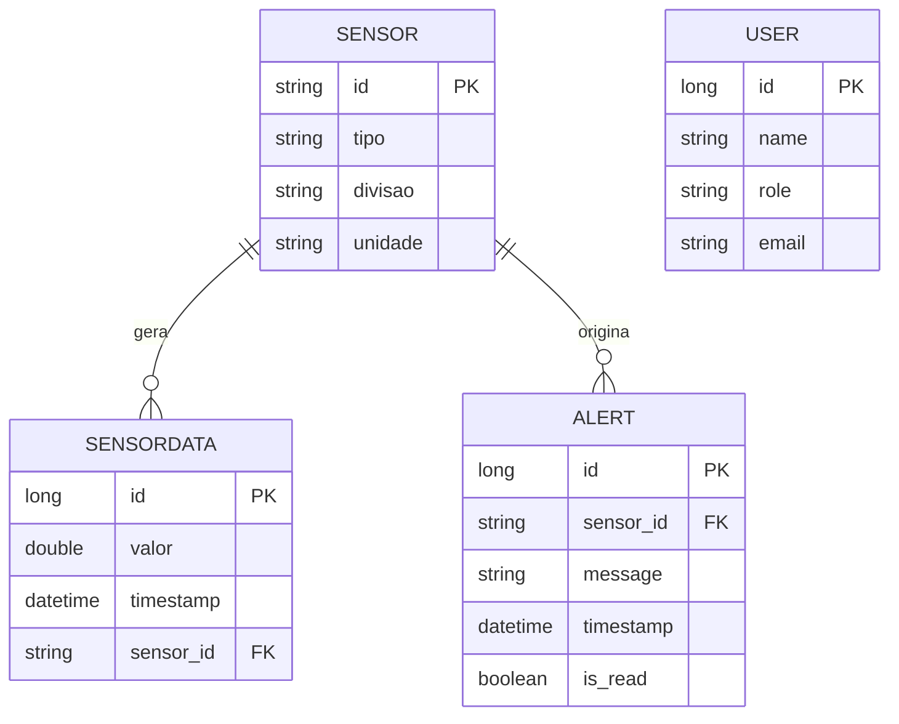

# Esquema Relacional — SmartHome System

## SENSOR

```sql
SENSOR(
    id PK,
    tipo,
    divisao,
    unidade
)
```

---

## SENSOR_DATA

```sql
SENSOR_DATA(
    id PK,
    sensor_id FK REFERENCES SENSOR(id),
    valor,
    timestamp
)
```

---

## ALERT

```sql
ALERT(
    id PK,
    sensor_id FK REFERENCES SENSOR(id),
    message,
    timestamp,
    is_read
)
```

---

## USERS

```sql
USERS(
    id PK,
    name,
    role,
    email
)
```

---

# Relações entre tabelas

```text
SENSOR (1) ─────── (N) SENSOR_DATA
   │
   └────────────── (N) ALERT
```

---

# Notas do modelo

* `Sensor.id` é chave primária natural (string)
* `SensorData.sensor_id` é chave estrangeira
* `Alert.sensor_id` também referencia `Sensor`
* `User` é independente (sem relações neste modelo atual)

---

# ESQUEMA RELACIONAL (MERMAID ERD)


