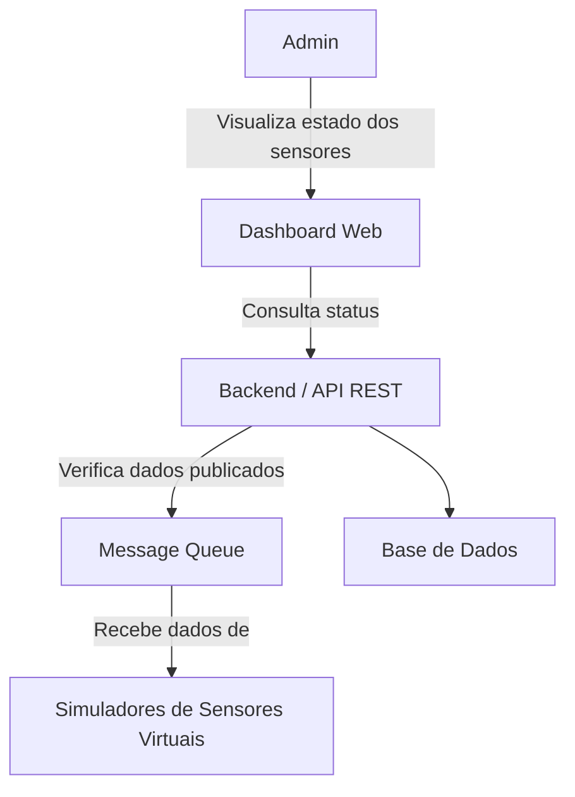
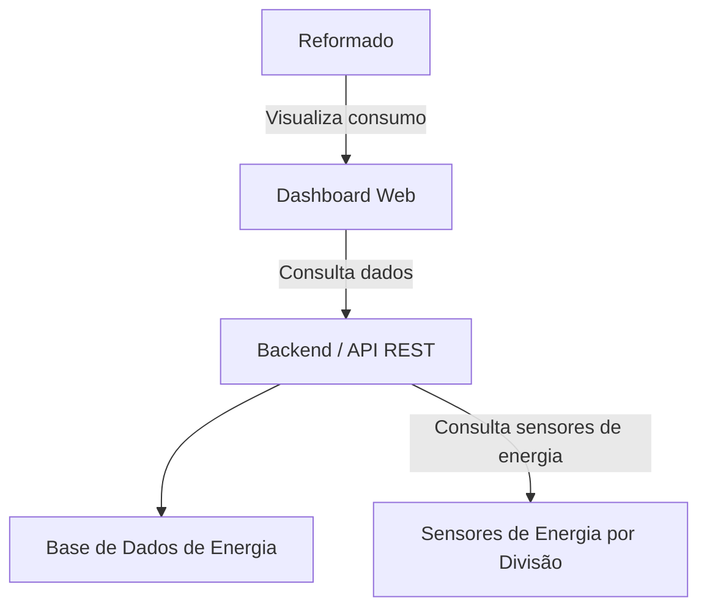
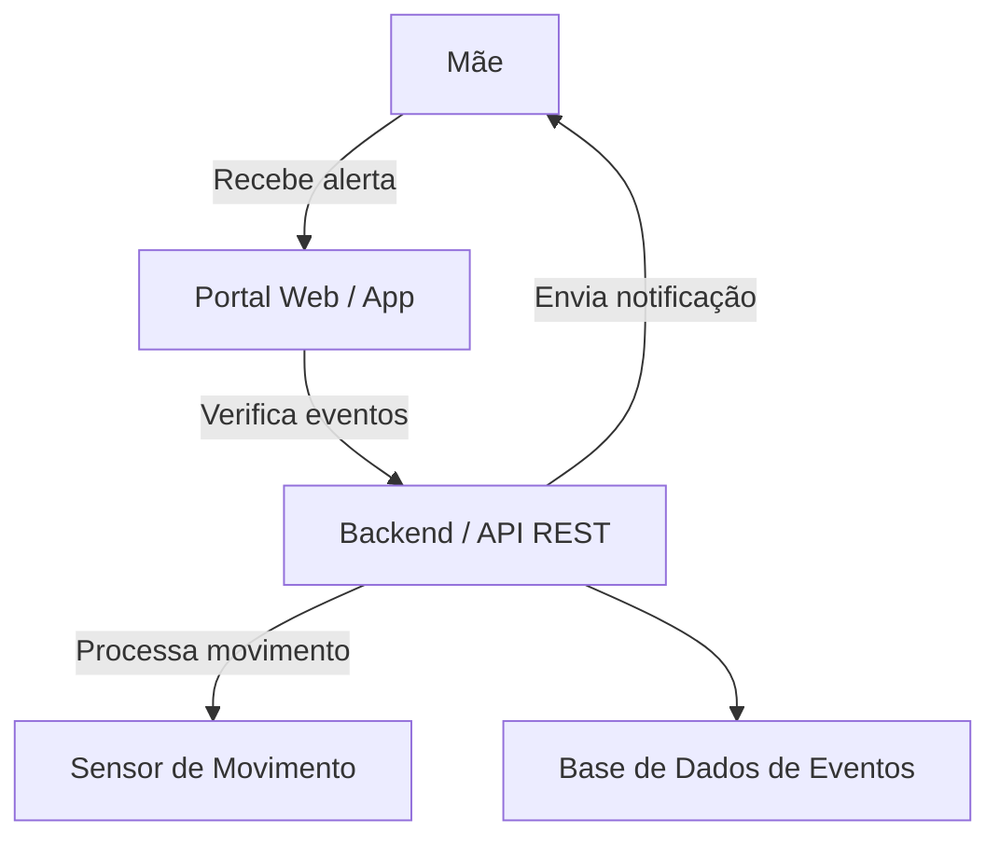
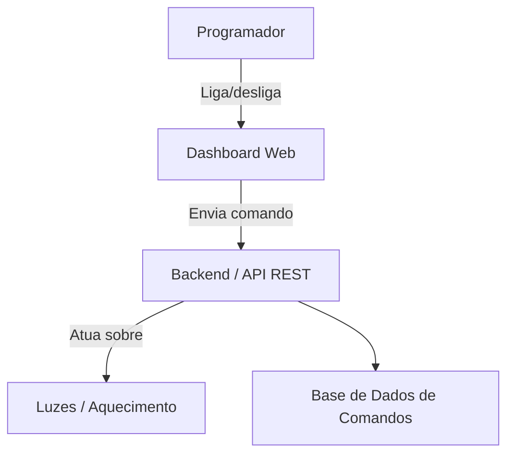

### **1. Admin – Dashboard de estado técnico**

**Explicação:** O admin vê o dashboard que recolhe informações da Message Queue e da base de dados para mostrar se todos os sensores estão a funcionar.

---

### **2. Reformado – Consumo de energia por divisão**

**Explicação:** O reformado quer ver consumo em cada divisão; os dados vêm dos sensores de energia e da base de dados.

---

### **3. Mãe – Alerta de movimento no quarto do bebé**

**Explicação:** Quando o sensor detecta movimento, o backend cria um evento, armazena na base de dados e envia alerta imediato ao portal.

---

### **4. Programador em teletrabalho – Controlar aquecimento e luzes**

**Explicação:** O programador envia comandos pelo dashboard; o backend processa e controla os atuadores físicos virtuais, registando a ação na base de dados.

