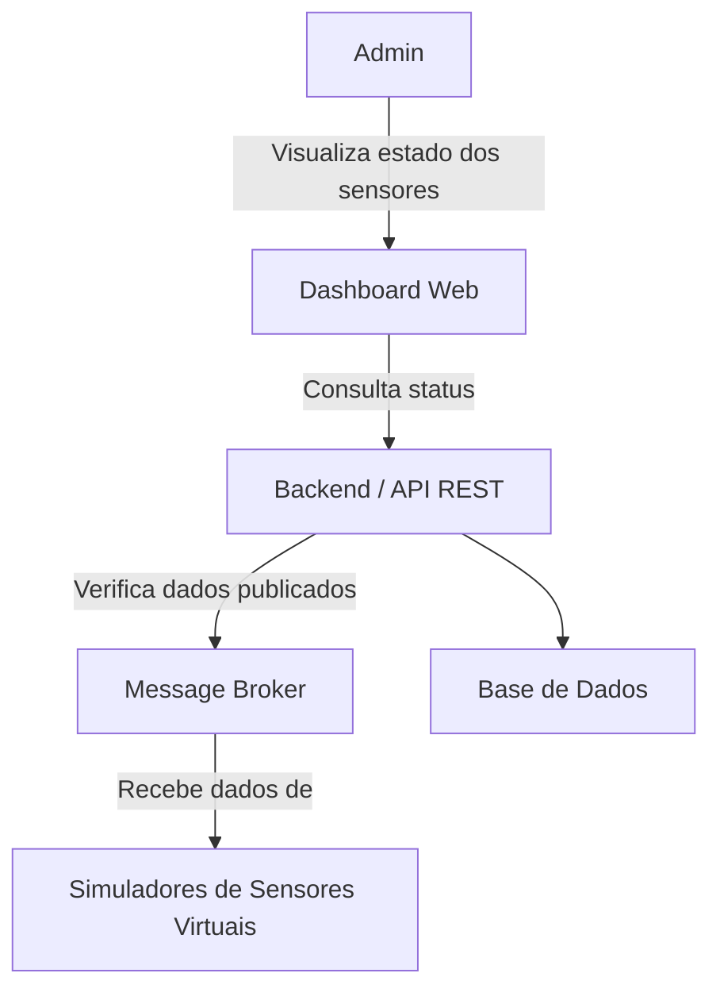
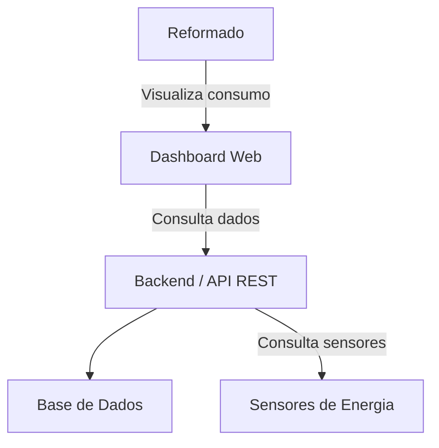
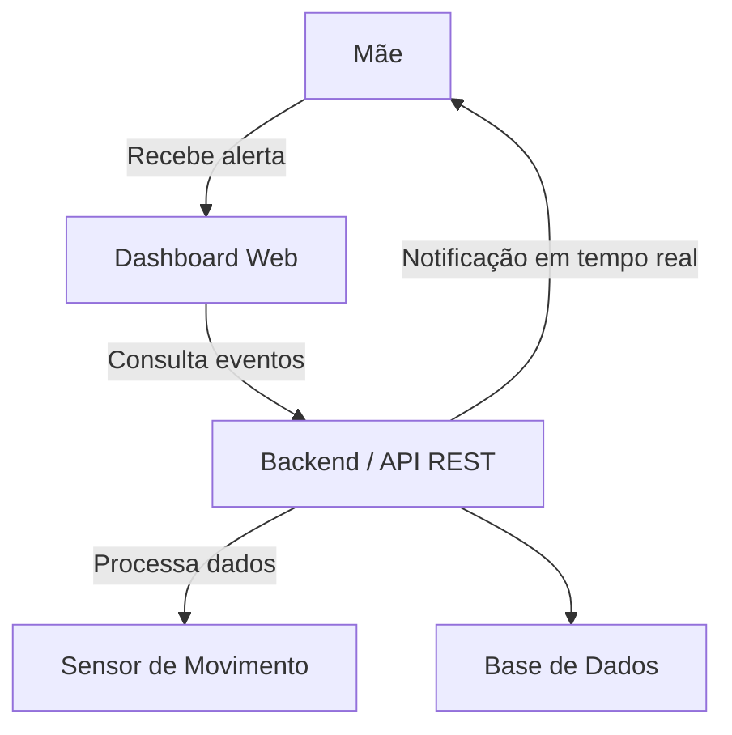
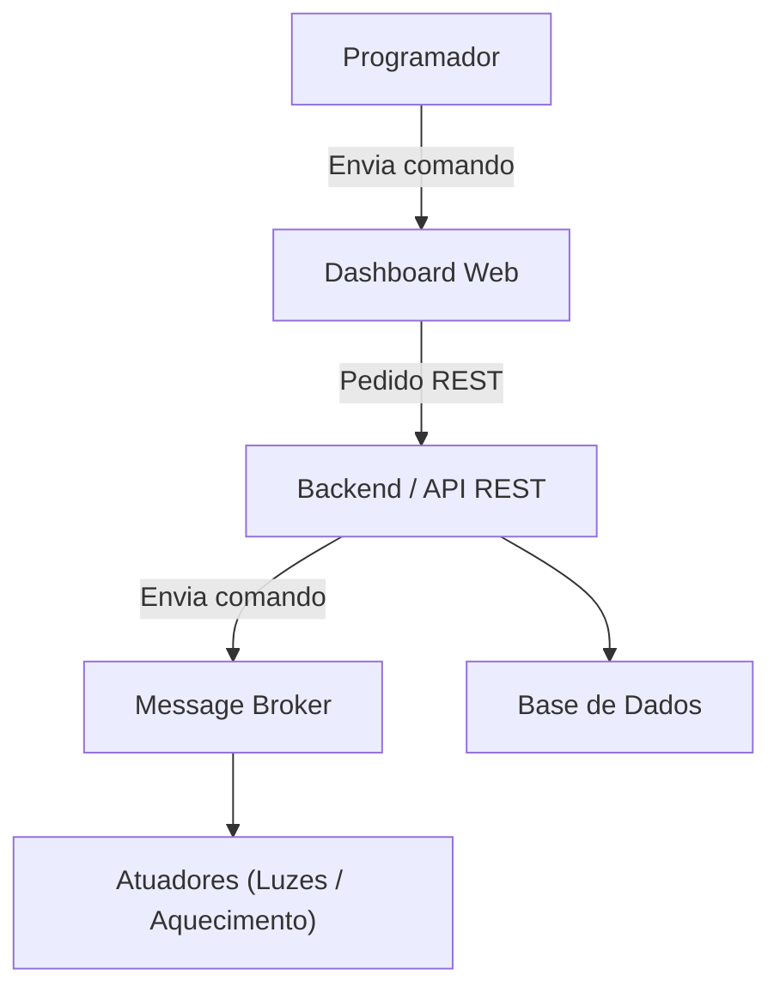
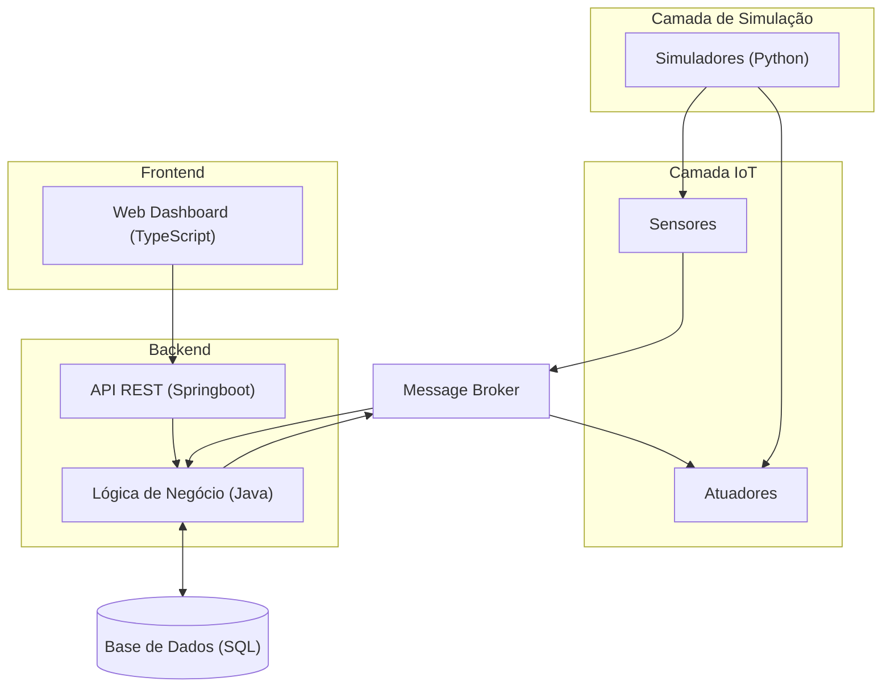

# Diagramas de User Stories + Protótipos

---

# Admin / Técnico de Sistemas

## User Stories
- **US2** – Verificação de Conetividade  
- **US1** – Monitorização de Saúde do Sistema  

### Destaque: US2 – Verificação de Conetividade

Protótipo: 

**Explicação:** O admin monitoriza o estado do sistema garantindo que todos os sensores estão a publicar corretamente.

---

# Reformado

## User Stories

* **US9** – Monitorização de Consumo
* **US10** – Iluminação de Segurança
* **US11** – Notificação de Gastos
* **US12** – Exportação de Dados

### Destaque: US9 – Monitorização de Consumo

Protótipo: 

**Explicação:** O utilizador acompanha o consumo energético por divisão para reduzir gastos.

---

# Mãe

## User Stories

* **US7** – Deteção de Intrusão/Movimento
* **US6** – Histórico Térmico
* **US8** – Log de Atividade

### Destaque: US7 – Deteção de Intrusão/Movimento

Protótipo: 

**Explicação:** O sistema gera alertas imediatos quando é detetado movimento, garantindo segurança.

---

# Programador em Teletrabalho

## User Stories

* **US5** – Atuação Remota
* **US3** – Alerta de Qualidade do Ar
* **US4** – Automação de Luminosidade

### Destaque: US5 – Atuação Remota

Protótipo: 

**Explicação:** O utilizador controla remotamente dispositivos sem interromper o trabalho.

---

# Arquitetura Geral do Sistema

---

# Todos os Protótipos

