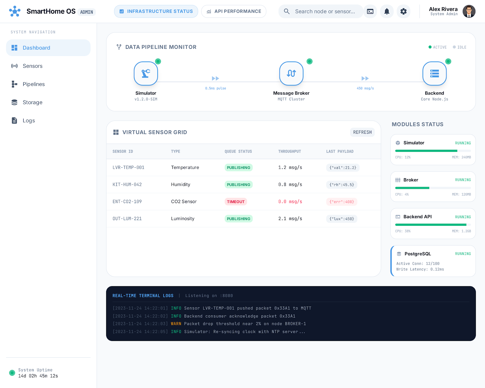
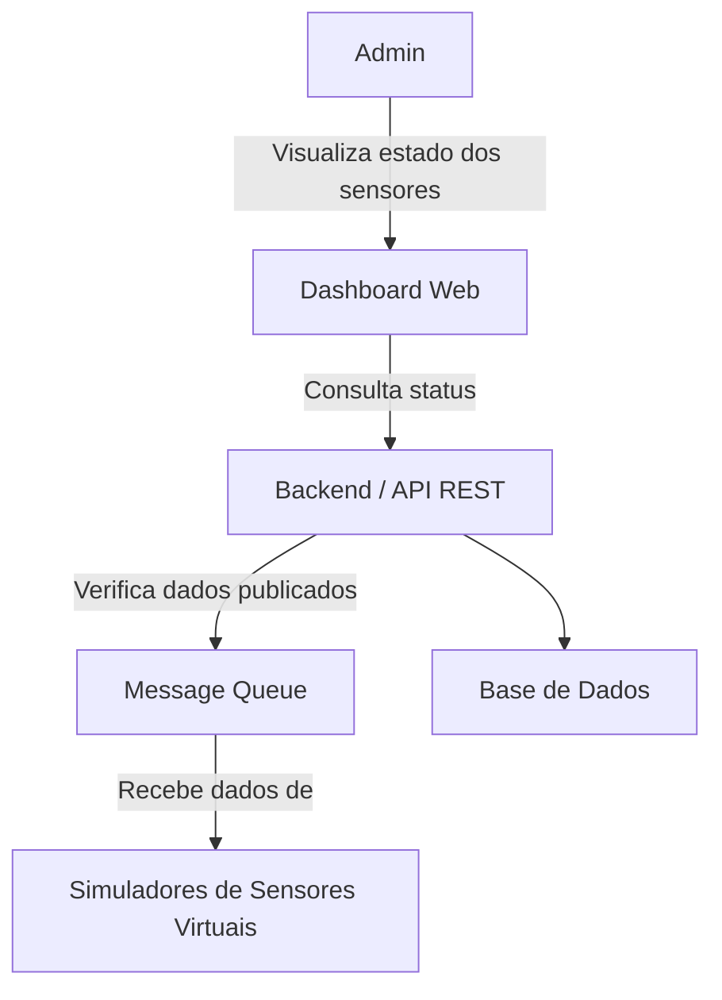
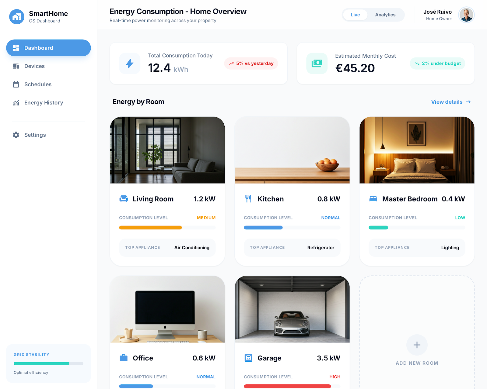
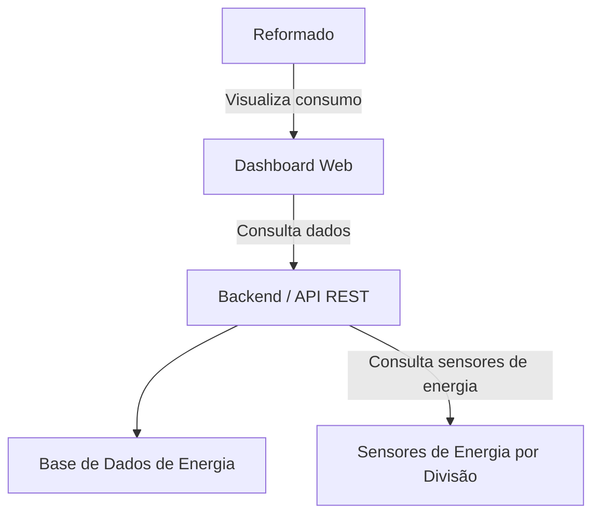
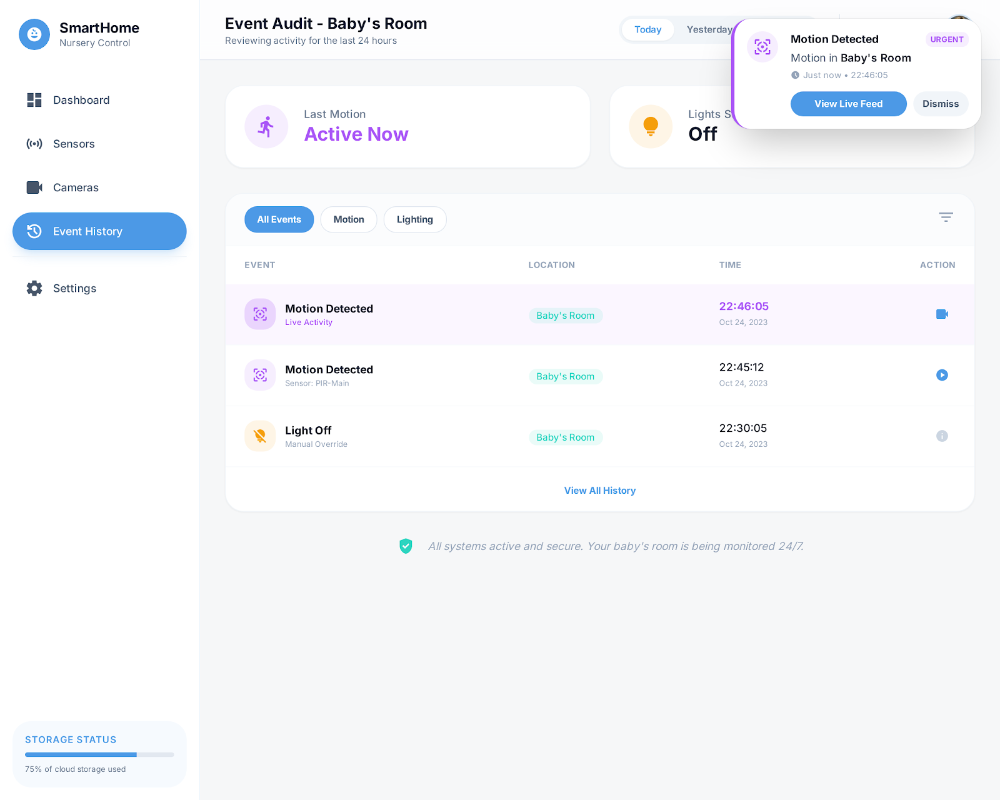
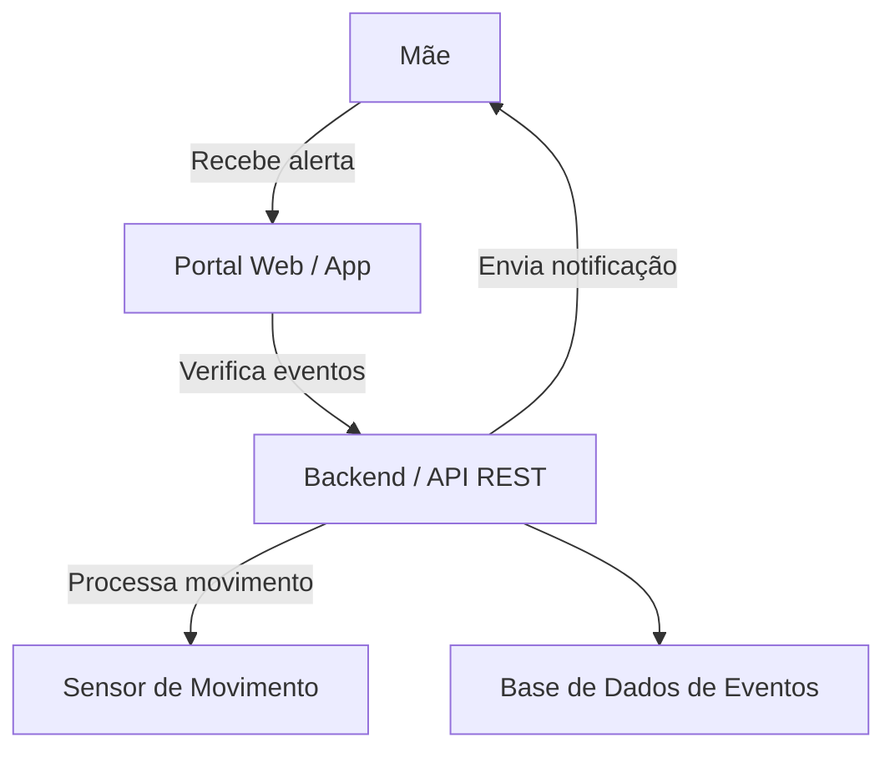
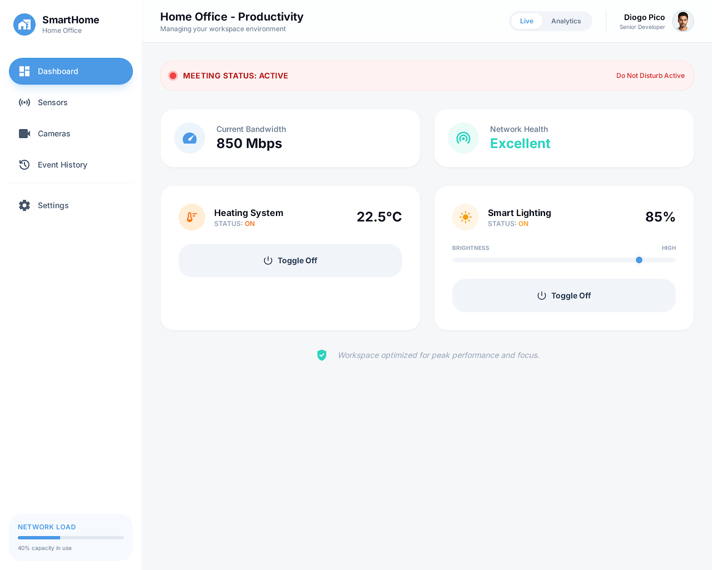
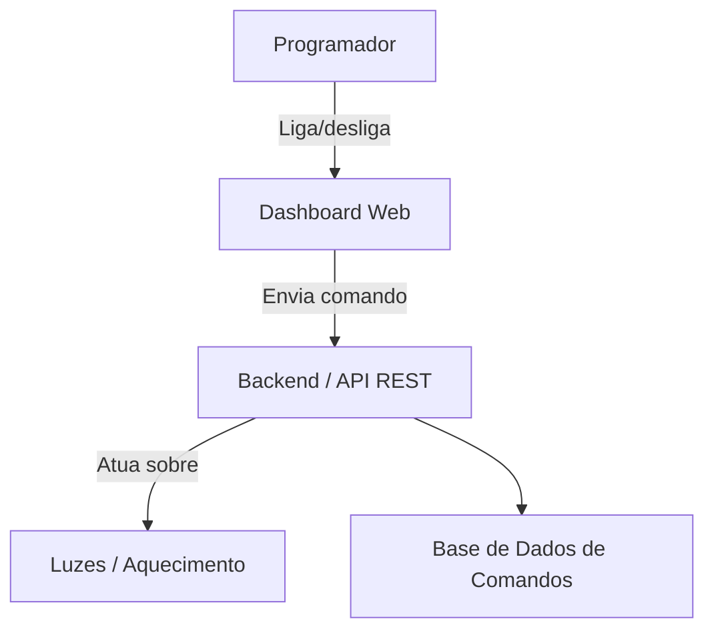
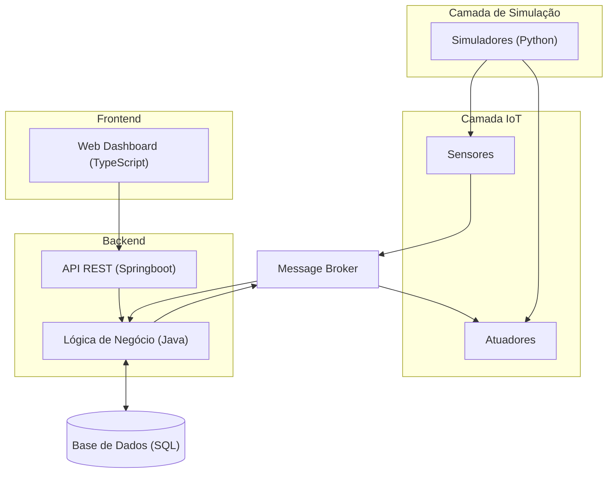
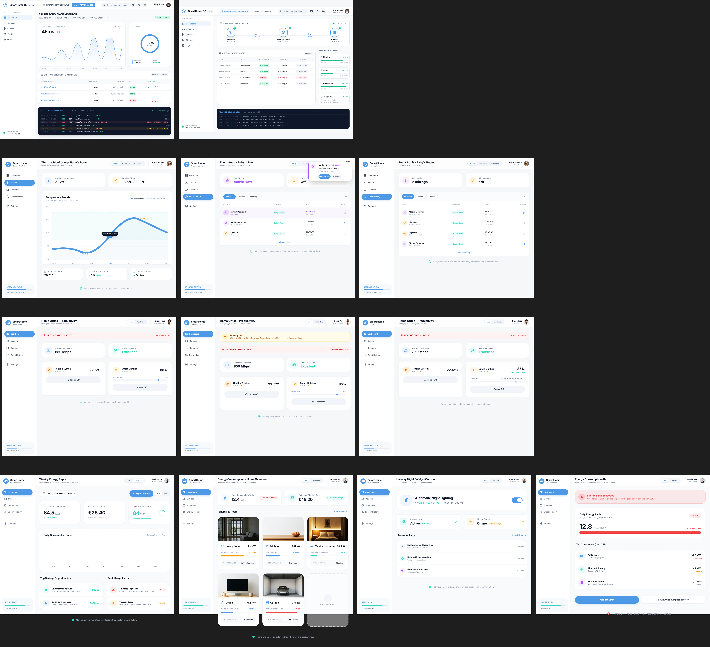

# Diagramas de User Stories + Protótipos

---

## **US2 – Verificação de Conetividade (Admin – Dashboard de estado técnico)**

Protótipo: 

**Explicação:** O admin vê o dashboard que recolhe informações da Message Queue e da base de dados para mostrar se todos os sensores estão a funcionar.

---

## **US9 – Monitorização de Consumo (Reformado – Consumo de energia por divisão)**

Protótipo: 

**Explicação:** O reformado quer ver consumo em cada divisão; os dados vêm dos sensores de energia e da base de dados.

---

## **US7 – Deteção de Intrusão/Movimento (Mãe – Alerta no quarto do bebé)**

Protótipo: 

**Explicação:** Quando o sensor deteta movimento, o backend cria um evento, armazena na base de dados e envia alerta imediato ao portal.

---

## **US5 – Atuação Remota (Programador – Controlo de luzes e aquecimento)**

Protótipo: 

**Explicação:** O programador envia comandos pelo dashboard; o backend processa e controla os atuadores virtuais, registando a ação na base de dados.

---

## Arquitetura Geral do Sistema

---

## Todos os Protótipos das User Stories

